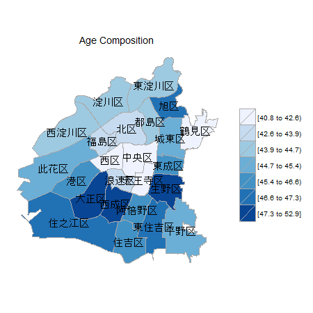

Osaka City Map for choroplethr
====================

## Original Map Data

This package is for the use with the choroplethr package.

You can draw the choropleth maps of Osaka, the second largest city in Japan. The original shp file is destributed by the City Planning Bureau of Osaka City, under CC-BY 2.1 license. For more details, see http://www.city.osaka.lg.jp/toshikeikaku/page/0000250227.html

## Install

```r
install_github("yutannihilation/choroplethrOsakaCity")
```

## How To Use

```r
library(choroplethrOsakaCity)
library(dplyr)

csv_file <- tempfile(fileext = ".csv")

download.file("https://raw.githubusercontent.com/yutannihilation/osaka_age_composition/master/osaka_age_composition.csv",
              destfile = csv_file, method = "curl")

data(region_correspondence_table, package = "choroplethrOsakaCity")

age_comp.df <- read.csv(csv_file, header = TRUE, stringsAsFactors = FALSE, fileEncoding = "UTF-8") %>%
  group_by(district) %>% 
  summarise(value = sum(age * total)/sum(total)) %>%
  mutate(district = paste0(district, '区')) %>%
  mutate(region = plyr::mapvalues(district,
                                  from = region_correspondence_table$region_name,
                                  to   = region_correspondence_table$region))

osaka_city_chropleth(age_comp.df, title = "Age Composition")
```

